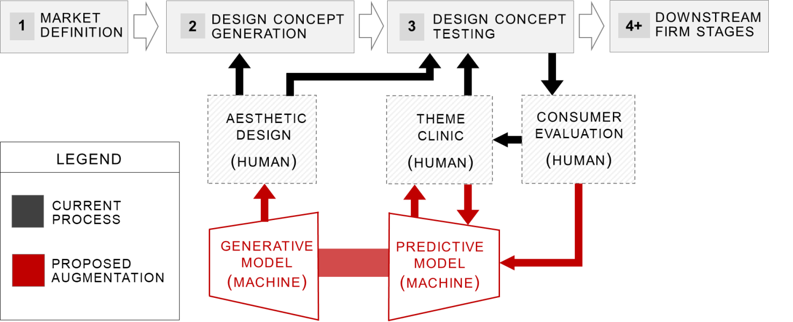

## Product Aesthetic Design: A Machine Learning Augmentation
Code to define and train machine learning models for generating and predicting product aesthetics, and replicate results in, "Product Aesthetic Design: A Machine Learning Augmentation."  This code includes a number of features:
* Combined model (from paper) and pretrained models for product design generation and prediction.
* Extendable to your own dataset via modular configuration file, model architecture, and training sessions.
* Checkpoint saving and resuming from previously saved model checkpoints. 

Examples:
* [Example Video Controllable Generation at 512x512](https://vimeo.com/497011714/)
* [Example Video of Controllable Generation at 256x256](https://vimeo.com/334094197)


If you find this work useful, please use the following citation information in plaintext or BibTeX format:

Burnap, A, Hauser, J, and Timoshenko, A (2021). Product Aesthetic Design: A Machine Learning Augmentation. Marketing Science (under review).

```
@article{burnap2021aesthetics,
  title={Product Aesthetic Design: A Machine Learning Augmentation},
  author={Burnap, A, Hauser, J, and Timoshenko, A},
  journal={Marketing Science (under review)},
  volume={XXX},
  number={XXX},
  pages={XXX},
  year={2021},
  publisher={XXX}
}
```

## Usage

#### Replicating the paper
The code in this repository can be used to replicate the results in the paper.  You will need to download the open access image and ratings data used in this work, install many open source libraries (see Installation), modify the hyperparameters and directory pathes for your environment in `config.py`, then run:

    python experiment.py


[//]: # (## Usage - )
#### Using your own data
Using your own data with this codebase requires you to convert your product image and aesthetics ratings datasets into the format the code expects. The dataset should be formatted by wrapping around the Torch Dataset object as well as HDF5
    for the underlying dataformat. This is a very fast data format and supports both
    loading into RAM or directly off disk.  Please see Installation and `chairs.py` for more details.

## Directory Structure
  ```
  ms21_product_aesthetic_design
  ├── config.py - configuration file for running experiments; this is the only file you will likely need to change
  ├── experiment.py - main script to run experiments; start training combined or baseline models
  |── aesthetics.yml - requirements file of python libraries and their versions necessary to run this code
  │
  ├── training
  │   ├── train.py - main training code for predictive, generative, and encoder models
  │   ├── train_pretrained_model.py - training code for benchmarked pretrained deep learning models
  │   ├── evaluate.py - evaluation code for evaluting both combined model and pretrained deep learning models
  │   └── session.py - training session state manager.  Needed for all model intialization and training
  │
  ├── data
  │   └── vehicles.py - data loader for product category in paper (automobiles)
  |   └── chairs.py - data loader for open access product category (chairs)
  │
  ├── models
  │   ├── model.py - custom neural network architecture for models used in this paper
  │   ├── layers.py - custom neural network primitives outside of the main Pytorch library used in this paper
  │   ├── baselines_pretrained.py - pretrained deep learning benchmark models used in this paper
  │   └── baselines_conventional.py - conventional computer vision + ML models used in this paper
  │
  ├── losses
  │   └── losses.py - custom losses defined in this paper (e.g., product attribute loss, mask loss)
  │
  └── utils
      ├── training_utils.py - various training utilities used in this paper outside of standard libraries
      ├── logging_utils.py - various logging utilities used in this paper outside of standard libraries
      └── video.py - utilities to create morphing videos by controlling the generative model as used in this paper
```
## Installation
#### Libraries
This codebase was developed on Ubuntu 20.04 and built using the Pytorch neural net framework.  However, it also depends on over 100 other Python packages, as well as GPU libraries including CUDA runtimes and cuDNN kernel support. We can not guarantee this code will run and replicate unless the same environment and library versions are used.  To install these packages (including the same library versions), please use the following:

    conda env create -f aesthetics.yml

This code also requires local installations of both OpenCV and HDF5 for image processing and data loading, respectively. Make sure your local HDF5 installation is updated to support "single writer multiple reader" (SWMR) mode for parallel access, as many default OS packages (including Ubuntu 20.04) are older than this support.

#### Data
To download the open access chair data (already formatted for HDF5), as well as the aesthetics ratings dataset (see paper), please use the following links. These downloads may take awhile, as the image dataset is over 120GB.


* #### [Open Access Image Dataset](https://www.dropbox.com/s/6onemyvia913lr0/chair_data_grayscale.h5?dl=0)
* #### [Open Access Mask Dataset](https://www.dropbox.com/sh/1yt7vyhkpmwu8nb/AACB3XgDpu2jrG3bfP3rKZFja?dl=0)
* #### [Chair Ratings Dataset](https://www.dropbox.com/s/dt4pn0stezivuqz/chair_ratings_traditional_modern.csv?dl=0), [Chair Indices Full](https://www.dropbox.com/sh/1yt7vyhkpmwu8nb/AACB3XgDpu2jrG3bfP3rKZFja?dl=0), [Chair Indices Labeled](https://www.dropbox.com/sh/1yt7vyhkpmwu8nb/AACB3XgDpu2jrG3bfP3rKZFja?dl=0) 


## Model Training
Unless modifying the model architecture, the only file you should need to change is `config.py`. This file contains all model training hyperparameters, model hyperparameters themselves, and directory pathes.  This file defines an OrderedDict object of all these parameters which is passed through various modular portions of the code. The Session object in `session.py` tracks training, and is the primary mechanism for tracking and logging training statistics.  Moreover, all models are defined via the Session object to enable easier model checkpointing and resuming from checkpoints.

####Notes on stabilizing model training

There are a number of heuristics necessary to train this model up to high resolutions as shown in the paper (i.e., 512 x 512).  It is important to follow these heuristics as the model has significant training instability due to its adversarial components.  Lower resolutions tend to be much easier to train (e.g., up to 64x64) for several reasons, but in general once the model gets to around 128x128 it is necessary to safeguard instabilities from the adversarial components.

* We use progressive training from 4x4, 8x8, ..., 512x512. The current resolution is tracked by the current "phase" of training.  Each phase is power of 2, e.g., phase 3 is 32x32.
* In general, higher resolutions are significantly harder to train due to instabilities, but result in better predictive and generative performance if stabilized. We start imposing:
    * KL-divergence on latent space at 8x8
    * Semi-supervised ratings loss at 32x32
    * Product attribute multinomial loss at 32x32
* Generator is updated 10x for every encoder update.  This is dependent on the entropy of the dataset itself, and how unstable the adversarial terms behave during training.
* We found it necessary to implement several training safeguards due to the instability of the adversarial training.  Primarily safeguards on the margin between KL loss terms, but also other safeguards including limiting the log-variance terms of the variational distributions.  See the paper for more details.

#### Saving and resuming training from model checkpoints
This codebase is setup to periodically save model checkpoints (i.e., all model parameters and Session that tracks model training state). By default, this will be in the logging directory setup in the configuration file.

The code is also setup to resume training from a previously saved checkpoint by setting `c.load_checkpoint = True` and the path for the previously saved checkpoint under `c.load_checkpoint_dir`.

#### Using Multiple GPUs
You can enable multi-GPU training by setting `c.env.CUDA_VISIBLE_DEVICES` argument of the config file to larger number.
If configured to use smaller number of gpu than available, first n devices will be used by default.

## License
The code is licensed under the MIT license. Feel free to use this code for your research. If you find this code useful, please use the following citation information in plaintext or BibTeX format:

Burnap, A, Hauser, J, and Timoshenko, A (2021). Product Aesthetic Design: A Machine Learning Augmentation. Marketing Science (under review).

```
@article{burnap2021aesthetics,
  title={Product Aesthetic Design: A Machine Learning Augmentation},
  author={Burnap, A, Hauser, J, and Timoshenko, A},
  journal={Marketing Science (under review)},
  volume={XXX},
  number={XXX},
  pages={XXX},
  year={2021},
  publisher={XXX}
}
```

## Acknowledgments
Portions of this codebase were built on elements from the following papers or open source projects, please see their respective licenses and cite accordingly:
* [Pioneer Networks: Progressively Growing Generative Autoencoder (special thanks to Ari Heljakka)](https://github.com/AaltoVision/pioneer)
* [Variational Approaches for Auto-Encoding Generative Adversarial Networks (Appendix D - Empirical KL Divergence / Density Ratio)](https://arxiv.org/abs/1706.04987)
* [Adversarial Generative Encoders](https://github.com/DmitryUlyanov/AGE)
* [Progressive Growing of GANs](https://github.com/tkarras/progressive_growing_of_gans)
* [Attention GAN](https://github.com/akanimax/attn_gan_pytorch/)
* [IntroVAE: Introspective Variational Autoencoders forPhotographic Image Synthesis](https://arxiv.org/pdf/1807.06358.pdf)
* [Categorical Reparametrization with Gumbel-Softmax](https://arxiv.org/pdf/1611.01144.pdf)

[//]: # (## TODOs)

[//]: # (- [X] Semi-supervised learning based on vehicle id.)

[//]: # (- [X] Combined model includes predictive and generative models.)

[//]: # (- [X] Get baseline models working in main experiment code)

[//]: # (- [X] Get cometML working)

[//]: # (- [X] Gumbel-Softmax for mixture components.)

[//]: # (- [X] Include mixture model terms)

[//]: # (- [X] Include Gumbel-Softmax entropy term)

[//]: # (- [X] Kullbeck-Leibler terms calculated using density ratio and/or reparametrization trick &#40;or both&#41;)

[//]: # (- [X] Refactor for open source release.)

[//]: # ()
[//]: # ()
